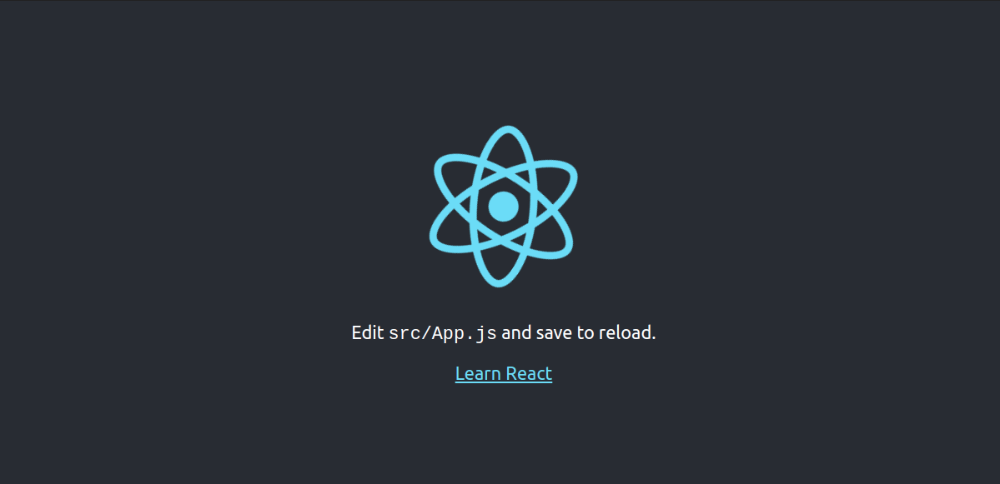

# Calculator

> This is a SPA in which you can do calculations on a calculator

## Built With

- React/JS
- HTML & CSS

## Live Demo

- Under construction..._

### Setup

To get a local copy up and running follow these simple example steps.

Click [here](https://github.com/sneeu-leeu/math-magicians) to go to the repo and clone the project by opening your terminal and entering "git clone" + "The link supplied".

cd into the repo by typing
$ cd ./your-path/math-magicians

$ git checkout feature/components

$ npm install

$ npm start

## Authors

👤 **Stephan**

Github: @sneeu-leeu

Twitter: @Stephan07484055

Linkedin: Stephan Annandale

## 🤝 Contributing

Contributions, issues, and feature requests are welcome!

Feel free to check the [issues page](https://github.com/sneeu-leeu/To-Do-List/issues/4).

## Show your support

Give a ⭐️ if you like this project!

## 📝 License

This project is [MIT](https://opensource.org/licenses/MIT) licensed.
